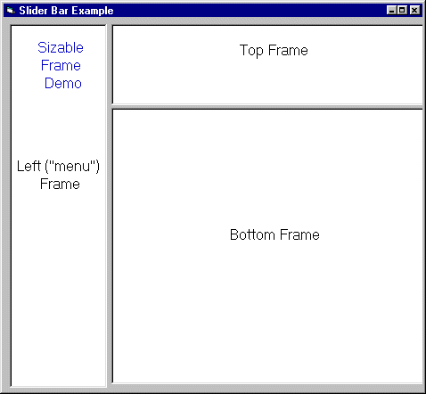



## Outlook\-Style Splitter Form

### Description

This form can be used as a template for creating dynamic "Outlook" style forms in VB. Each frame resizes independently...and best of all, NO OCX!
 
### More Info
 

             |
---                |---
**Submitted On**   |2001-04-10 13:32:42
**By**             |[Matthew Roberts](https://github.com/Planet-Source-Code/PSCIndex/blob/master/ByAuthor/matthew-roberts.md)
**Level**          |Beginner
**User Rating**    |4.7 (52 globes from 11 users)
**Compatibility**  |VB 5\.0, VB 6\.0
**Category**       |[Custom Controls/ Forms/  Menus](https://github.com/Planet-Source-Code/PSCIndex/blob/master/ByCategory/custom-controls-forms-menus__1-4.md)
**World**          |[Visual Basic](https://github.com/Planet-Source-Code/PSCIndex/blob/master/ByWorld/visual-basic.md)
**Archive File**   |[Outlook\-St181854102001\.zip](https://github.com/Planet-Source-Code/matthew-roberts-outlook-style-splitter-form__1-22284/archive/master.zip)

